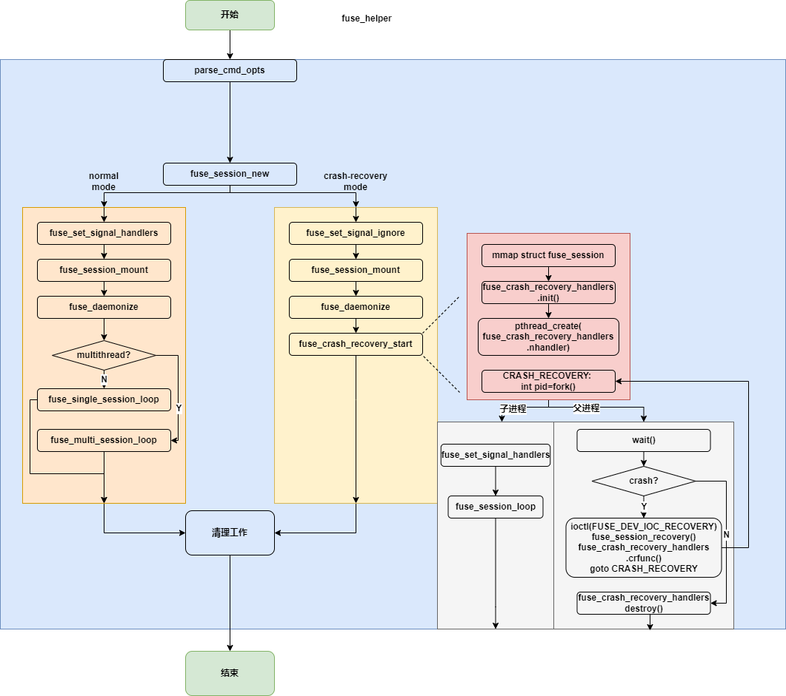

# fuse-extent

fuse-extent 项目致力于扩展 fuse 的功能，增强 fuse 的性能。目前主要包括两个子项目：
1. fuse-crash-recovery 该子项目主要是构建一个基于 fuse 的用户态文件系统的 crash 自动恢复框架。
2. fuse-based-ebpf 该子项目主要是基于 ebpf 来提升 fuse 的性能。

## fuse-crash-recovery
Linux内核部分见patch: https://github.com/OpenCloudOS/OpenCloudOS-Kernel/commit/e1c207b3e7cdfd98ce1120a38c979d748e95f95

### 介绍
FUSE 是一个用户态文件系统的框架。它由内核模块 (fuse.ko)，用户空间库 (libfuse.*) 以及一个挂载程序 (fusermount) 组成，用户借助 libfuse 编写自定义的用户态文件系统。在这个项目中，我们去除对 libfuse 的依赖，使用内核提供的接口，实现一个用户态文件系统，并具有 crash-recovery 功能，在用户态守护进程故障后恢复重启。

### fuse-crash-recovery 第一版（依赖libfuse）
 基于libfuse(https://github.com/libfuse/libfuse.git)构建。整个方案实现包含两部分，一部分在Linux
 内核的fuse部分，主要实现在crash恢复阶段将in-flighting的IO请求重新放回fuse的Pending队列中，以待恢复后的
 用户态fuse文件系统服务重新获取此IO请求；另一部分基于libfuse构建（是否使用libfuse并没有强依赖)，在libfuse
 的passthrough_ll样例中展示了用户态的实现方式。

 用户态代码路径：
 https://github.com/OpenCloudOS/libfuse branch:fuse-extent

### fuse-crash-recovery 第二版 （不依赖libfuse）
1. 当前版本不支持 fuseblk；
2. 实现了主要的文件系统功能（部分文件系统功能未实现，如 symlink 等）；
3. 同时目前实现的故障恢复功能不支持多线程模式在启用 `--clonefd` 选项，即 `ioctl(FUSE_DEV_IOC_CLONE)` 情况下的故障恢复；
4. 如果希望自定义的文件系统支持故障恢复功能，那么应该实现 `fuse_crash_recovery_handlers` 中提供的接口，以保存工作进程故障之后需要保存的内存数据结构。

### 构建
在项目根目录下
```
mkdir build && cd build
cmake ..
cmake --build .
```
#### 运行
构建完成后在根目录下输入如下命令，运行 example 中的文件系统程序，它会将文件系统挂载到根目录的 ./fusedir/testdir 下：
```
./build/example/passthrough_cr -d ./fusedir/testdir
```
这个用户态文件系统的功能是将挂载目录下的所有文件系统操作重定向到 "/" 目录。

### 执行流程

```c
-> int parse_cmd_opts(struct fuse_args *args, struct fuse_cmd_opts *opts);
-> struct fuse_session *fuse_session_new(struct fuse_args *args, const struct fuse_ops *ops, int debug, void* userdata);
--> int parse_mnt_opts(struct fuse_args *args, struct fuse_mnt_opts *opts);
--> int parse_conn_info(struct fuse_args *args, struct fuse_conn_info *info);
-> int fuse_set_signal_handlers(struct fuse_session *se);
-> int fuse_session_mount(struct fuse_session *se, const char *mountpoint);
-> int fuse_daemonize(int foreground);
-> int fuse_single_session_loop(struct fuse_session *se) or int fuse_multi_session_loop(struct fuse_session *se, int clonefd, unsigned threads);
```
具体流程图如下：


### 项目文件说明
1. [fuse_option.h 文件说明](./doc/实现思路/fuse_option.md)：主要包括命令行参数及挂载参数的解析函数；
2. [fuse_session.h 文件说明](./doc/实现思路/fuse_session.md)：主要包括会话的初始化函数；
3. [fuse_mount.h 文件说明](./doc/实现思路/fuse_mount.md)：主要包括文件系统的挂载（以及解除挂载）操作函数；
4. [fuse_loop.h 文件说明](./doc/实现思路/fuse_loop.md)：提供不断从设备文件中读取用户请求并处理（包括单线程和多线程）的函数；
5. [fuse_operation.h 和 fuse_operation.c 文件说明](./doc/实现思路/fuse_operation.md) 分别定义了用户态文件系统需要实现的函数接口以及不同请求的处理函数；
6. [fuse_signal.h 文件说明](./doc/实现思路/fuse_signal.md)：提供对某些信号默认处理函数进行重新设置的功能；
7. [fuse_crash.h 文件说明](./doc/实现思路/fuse_crash.md)：定义了故障恢复需要实现的函数接口以及工作进程和故障修复进程间传递文件描述符的函数；
8. fuse_helper.h 文件说明：通过调用上述文件中提供的接口，提供在正常模式或是故障恢复模式下启动文件系统的函数；
9. fuse_req.h 文件说明：定义了工作进程需要处理的请求体及请求队列；
10. fuse_reply.h 文件说明：包括工作进程完成请求后向内核响应的函数；
11. fuse_log.h 文件说明：简单地打印日志信息；
12. fuse_error.h 文件说明：工作进程启动过程中可能发生的错误类型定义；
13. fuse_kernel.h 文件说明：fuse 内核提供的接口，与 include/uapi/linux/fuse.h 保持一致。

其他过程文档在 doc 目录

### 故障重启测试
```bash
> /root/fuse-extent/build/example/passthrough_cr -d /root/fuse-extent/fusedir/testdir
> cat haha
> ps -ef|grep pass
root     1640224 1640221  0 11:31 pts/0    00:00:00 /root/fuse-extent/build/example/passthrough_cr -d /root/fuse-extent/fusedir/testdir
root     1640226 1640224  0 11:31 pts/0    00:00:00 /root/fuse-extent/build/example/passthrough_cr -d /root/fuse-extent/fusedir/testdir
// kill child process
> kill -8 1640226
// output of the cat
```
#### 测试环境
1. fuse kernel version: 7.31
2. fusermount version: 2.9.7
3. linux kernel version: 5.4.119


## fuse-based-ebpf

### 原理
fuse-based-ebpf 的优化主要是针对部分操作，如高频的 lookup，通过 ebpf 在内核部分生成 cache，在用户执行 lookup 时无需再与用户态文件系统服务进程交互，从而提升 fuse 文件系统的性能。

### 组件
组件包括一个libextfuse库（包括epbf程序），内核patch: https://github.com/OpenCloudOS/OpenCloudOS-Kernel/commit/eab7730c17c6ed5d61efdf01e7213674e37d863f.
